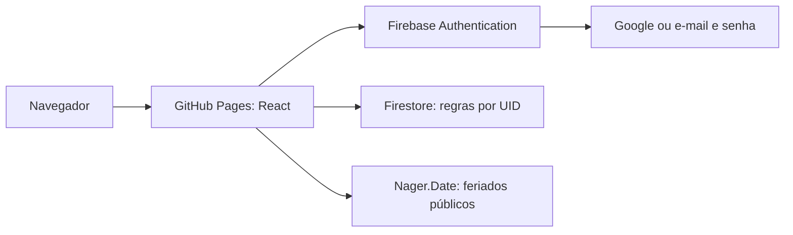

# Firebase, GitHub Pages e apresentação da versão online

Esta evolução foi solicitada depois da entrega júnior/pleno. Ela acrescenta autenticação e publicação, sem implementar dashboard ou gráficos do desafio sênior. Os documentos de arquitetura, API e apresentação originais descrevem o perfil REST/SQLite; este documento descreve o perfil online atual.

## O que foi feito

1. Criado o projeto **Diel Task Calendar**, ID `diel-task-calendar-e704c`, na conta do usuário, plano Spark. Analytics e Gemini opcionais foram desativados no assistente de criação.
2. Registrado o aplicativo **Diel Calendar Web** e integrado o SDK modular Firebase 12.19.0 ao React.
3. Implementada tela de login responsiva, mantendo a identidade visual verde do calendário, com entrada Google, e-mail/senha, cadastro, confirmação de senha, recuperação, estados de carregamento e erros em português.
4. Implementado observador `onAuthStateChanged`, carregamento inicial da sessão, botão Sair e remontagem do calendário por UID para descartar estado visual ao trocar de conta. A sessão usa a persistência padrão do Firebase Auth no navegador.
5. Substituída a persistência da versão online pelo Firestore. A API original e seus testes permanecem disponíveis com `VITE_DATA_MODE=rest` para apresentação dos requisitos REST.
6. Criadas regras que exigem autenticação e correspondência entre o UID autenticado e o caminho do documento; validam campos, limites, tipos e timestamps. Caminhos não autorizados ficam bloqueados.
7. Mantidos CRUD, filtros, duração, sobreposição de datas, visualizações e tags. Nomes de tags são reservados em transação para impedir duplicatas no fluxo normal da aplicação.
8. Movida a consulta de feriados da versão online para a API pública Nager.Date diretamente no navegador, com timeout de 5 segundos, cache em memória por 24 horas e filtro de feriados nacionais públicos. Falhas não bloqueiam tarefas.
9. Configurado GitHub Pages com deploy por Actions, base path do repositório, artefato estático e verificações antes da publicação. Nenhum servidor local precisa ficar ligado.
10. Adicionados 8 testes de validação/filtros da persistência online e 8 cenários nos emuladores (3 de autenticação e 5 de regras Firestore), preservando os 32 testes originais. Atualizada a documentação e mantidas mensagens de commit em inglês.

## Como explicar a arquitetura



“O GitHub Pages entrega HTML, CSS e JavaScript. Como não executa Node nem SQLite, a versão online usa Firebase para identidade e dados. O login gera a identidade validada pelo Firebase; as regras do Firestore conferem essa identidade em cada operação. Esconder uma tela no React não seria segurança suficiente. A API Fastify original continua no repositório como implementação REST local.”

## Arquivos e responsabilidades

| Arquivo                       | Responsabilidade                                  |
| ----------------------------- | ------------------------------------------------- |
| `components/AuthGate.tsx`     | Estado de autenticação, telas de acesso e logout  |
| `lib/firebase.ts`             | Inicialização única de Auth e Firestore           |
| `lib/api.ts`                  | Operações Firestore e escolha do adaptador REST   |
| `lib/cloud-domain.ts`         | Validação e filtro de sobreposição, título e tags |
| `lib/errors.ts`               | Mensagens Firebase compreensíveis em português    |
| `lib/holidays.ts`             | Feriados via HTTP, timeout e cache                |
| `firestore.rules`             | Autorização e validação executadas pelo serviço   |
| `tests/firestore.rules.mjs`   | Tentativas permitidas e bloqueadas no emulador    |
| `.github/workflows/pages.yml` | Verificação, teste de regras, build e deploy      |

## Dados e segurança

Cada pessoa acessa `/users/{uid}/tasks/{taskId}`, `/users/{uid}/tags/{tagId}` e `/users/{uid}/tagNames/{hash}`. Não existe uma coleção pública de tarefas.

Uma tarefa armazena título, descrição, início como Timestamp, duração inteira, IDs de tags e timestamps de criação/atualização do servidor. As tags guardam nome, cor e hash SHA-256 do nome em minúsculas para a reserva de unicidade. O índice é atualizado junto da tag em uma transação. Essa unicidade é uma garantia do adaptador; as regras não recalculam o hash de nomes enviados por clientes modificados, mas continuam isolando os dados por dono.

A duração máxima é sete dias. Uma consulta busca o período visível com sete dias anteriores para incluir tarefas que começaram antes e continuam no período. O frontend refina sobreposição, título e tags, evitando índices compostos para cada combinação de filtros. A quantidade de leituras cresce com os documentos desse intervalo; não há paginação, sincronização em tempo real nem pesquisa textual indexada.

Ao apagar uma tag, o documento e sua reserva são removidos em transação. Tarefas são preservadas. IDs antigos podem continuar nos documentos de tarefas, mas são ignorados na leitura porque só tags existentes são exibidas. Uma edição posterior salva apenas os IDs selecionados. Isso evita uma exclusão em massa com limite de lote; difere da cascata relacional da versão SQLite.

As regras limitam título a 160 caracteres, descrição a 5.000, nome da tag a 40, duração a 1–10.080 minutos, lista a 20 tags sem duplicatas e cor hexadecimal. A criação exige timestamps de servidor, e a atualização preserva `createdAt`. O frontend valida também, para dar respostas imediatas. O banco começa vazio para cada conta.

A configuração Firebase Web é pública por definição e vai no JavaScript. Não foi adicionada chave de conta de serviço, senha administrativa nem token ao repositório. A proteção depende das regras e da autenticação. O cache de documentos é em memória, sem habilitar cache offline persistente. A sessão de login permanece até Sair; em um computador compartilhado, use Sair ao terminar.

## Configuração e manutenção

- Projeto: `diel-task-calendar-e704c`; aplicativo Web: Diel Calendar Web.
- Provedores: Google e e-mail/senha. O nome público é Diel Task Calendar; o suporte é a conta proprietária selecionada no console.
- Domínio de produção: `pedrobarberini.github.io`; desenvolvimento: `localhost`.
- Banco `(default)`, edição Standard, região `southamerica-east1` (São Paulo), iniciado em modo de produção.
- Publicação: pushes na `main` disparam o workflow de Pages; o job de deploy depende de todos os checks e do emulador.
- Os documentos SQLite existentes não foram enviados para a nuvem. O seed continua sendo exclusivo do perfil local.
- O plano Spark possui cotas gratuitas; não foi associado faturamento nem habilitado upgrade. Se as cotas forem atingidas, operações podem ser recusadas. Consulte o console para consumo real.

Para publicar futuras alterações das regras, o proprietário pode autenticar a CLI oficial e executar:

```bash
pnpm dlx firebase-tools@15.30.2 login
pnpm dlx firebase-tools@15.30.2 deploy --only firestore:rules,firestore:indexes --project diel-task-calendar-e704c
```

O deploy do Pages não precisa de credenciais Firebase administrativas, pois apenas compila a configuração pública. O workflow não publica regras automaticamente.

Para testar as regras localmente, instale Java 21 e execute na raiz:

```bash
pnpm dlx firebase-tools@15.30.2 emulators:exec --only auth,firestore --project demo-diel-calendar "node --test apps/web/tests/auth.flows.mjs apps/web/tests/firestore.rules.mjs"
```

O prefixo `demo-` mantém os testes sem acesso ao projeto real. Os testes exercitam CRUD do dono; bloqueio de acesso sem login e de outra conta em todas as coleções privadas; documentos inválidos; timestamps; tags; e caminhos desconhecidos.

## Roteiro para apresentar

Para explicar o código e as decisões etapa por etapa, comece pelo [roteiro de raciocínio e código](RACIOCINIO_E_CODIGO.md).

1. Abra o link público e explique que o computador local pode estar desligado.
2. Mostre a tela de acesso e entre com Google. Uma primeira conta estará vazia.
3. Crie uma tag e uma tarefa, navegue entre dia/semana/mês e demonstre os filtros.
4. Recarregue: a sessão e os dados permanecem. Mostre edição e exclusão com confirmação usando dados de demonstração.
5. Use Sair e explique que outra conta tem seu próprio calendário.
6. Abra `AuthGate.tsx`, `api.ts` e `firestore.rules` para seguir o fluxo tela → identidade → autorização → persistência.
7. Mostre o workflow e os resultados dos testes. Explique a diferença entre testes de regras no emulador e login Google real no navegador.
8. Para os requisitos REST do PDF, demonstre o perfil local e seus endpoints conforme `API.md`. Não descreva a API local como protegida pelo Firebase: ela não recebe nem valida tokens.

## Limites explícitos

Não há dashboard, gráficos, tarefas recorrentes, notificações, integração com Google Calendar, recuperação automática de dados excluídos, migração entre bancos, MFA ou App Check. A senha mínima de 8 caracteres é exigida pela tela de cadastro; a política efetiva do serviço depende da configuração no Firebase. O login Google usa popup e pode exigir habilitar pop-ups. Sem rede, não é possível concluir gravações. Abas abertas simultaneamente só refletem alterações externas ao recarregar ou refazer consultas.

## Referências oficiais

- [Firebase Google Sign-In](https://firebase.google.com/docs/auth/web/google-signin)
- [Firebase e-mail e senha](https://firebase.google.com/docs/auth/web/password-auth)
- [Regras do Firestore](https://firebase.google.com/docs/firestore/security/rules-conditions)
- [Transações Firestore](https://firebase.google.com/docs/firestore/manage-data/transactions)
- [GitHub Pages](https://docs.github.com/en/pages/getting-started-with-github-pages/what-is-github-pages)

## Evidências da publicação

Em 23/09/2026, o site foi publicado em `https://pedrobarberini.github.io/diel-task-calendar/`. O workflow [35939294759](https://github.com/Pedrobarberini/diel-task-calendar/actions/runs/35939294759) aprovou formatação, TypeScript, 40 testes de código, build e 5 testes de regras Firestore antes do deploy. As regras foram publicadas no console Firebase. O endpoint público de configuração confirmou `pedrobarberini.github.io` entre os domínios autorizados.

A tela de login foi aberta e inspecionada no site publicado. O teste de popup Google no navegador integrado retornou erro de conexão; isso não comprova sucesso nem identifica sozinho a causa. Posteriormente, o usuário confirmou que o login no site publicado funcionou perfeitamente. Essa é uma confirmação manual do usuário; não uma execução automatizada do fluxo OAuth pelo assistente. Os testes adicionais de Authentication usam o emulador oficial para cadastro, senha incorreta, login/logout, recuperação de senha e identidade Google simulada; não substituem o consentimento OAuth real em produção.

[Documentação oficial dos testes de Authentication](https://firebase.google.com/docs/emulator-suite/connect_auth).
