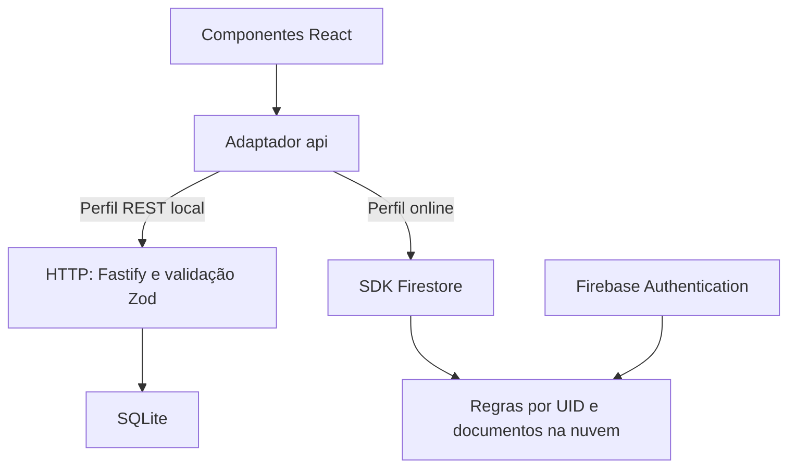

# Como apresentar o código e a linha de raciocínio

Este é o roteiro principal da apresentação atual. Ele conecta cada decisão ao código que existe no repositório. A ordem abaixo é didática, não uma afirmação de que cada arquivo foi escrito nessa sequência. As falas são sugestões: adapte-as ao que você estudou e consegue demonstrar.

O projeto foi construído com apoio de um assistente de programação. O importante na apresentação é demonstrar entendimento das decisões, dos fluxos e dos limites, descrevendo sua participação com precisão.

## A ideia que organiza toda a apresentação

Para cada parte, responda nesta ordem:

**Qual problema eu precisava resolver? → Que decisão a solução tomou? → Onde está isso no código? → Como sei que funciona? → Qual é o limite dessa escolha?**

Exemplo: “Uma tarefa pode atravessar a meia-noite. Por isso, a busca considera sobreposição de intervalos. A regra está em `tasksForDay`. Um teste cobre uma tarefa que continua no dia seguinte. Isso não significa que o sistema impeça conflitos de horário.”

Você não precisa narrar todas as linhas. Precisa acompanhar uma informação desde a entrada no formulário até a gravação e a atualização da tela.

## 1. Transformar o desafio em comportamentos verificáveis

**Problema:** o enunciado reúne interface, operações de dados, filtros e integração externa. Sem separar essas responsabilidades, fica difícil saber o que falta entregar.

**Decisão:** organizar a solução em tarefas, tags, calendário, feriados e persistência. A entrega original cobriu júnior/pleno; autenticação e publicação foram acrescentadas depois por solicitação. Dashboard e gráficos continuam fora do escopo.

**Fala sugerida:**

> “Começo pelos comportamentos que precisam funcionar: cadastrar uma tarefa, encontrá-la no período correto, classificá-la com tags e manter os dados depois de recarregar. Depois conecto cada comportamento a uma parte da implementação.”

**Mostre:** [README](../README.md) e a aplicação. Crie mentalmente critérios concretos: recarregar mantém a tarefa; remover uma tag preserva a tarefa; uma tarefa que atravessa a meia-noite aparece nos dois dias.

**Validação:** testes e demonstração desses critérios. “Tem um botão de salvar” não comprova persistência.

## 2. Definir o modelo de dados antes de discutir componentes

**Abra:** [types.ts](../apps/web/src/types.ts), depois [database.ts](../apps/api/src/database.ts).

Uma `Task` possui `id`, título, descrição, `startsAt`, `durationMinutes`, tags e datas de criação/atualização. Uma `Tag` possui identidade, nome e cor. `TaskInput` representa o que o formulário envia: IDs de tags em vez de objetos completos.

**Raciocínio:** a tarefa precisa de um início e de uma duração; o fim pode ser calculado. Guardar também um fim independente criaria mais um campo que teria de permanecer coerente. Usar o ID da tag permite renomeá-la sem trocar sua identidade.

```text
fim = início + duraçãoEmMinutos × 60.000
```

**Fala sugerida:**

> “Separei o formato de entrada do formato de leitura. Para salvar, envio os IDs das tags escolhidas. Para desenhar a tarefa, preciso também dos nomes e das cores dessas tags.”

No SQLite, o relacionamento é muitos para muitos: uma tarefa tem várias tags e uma tag pertence a várias tarefas. `task_tags` conecta os IDs e sua chave composta impede repetir o mesmo vínculo. `ON DELETE CASCADE` apaga vínculos quando a tarefa ou tag é removida; não apaga as tarefas ao remover uma tag.

**No Firestore:** as tarefas guardam `tagIds`. Os objetos das tags são montados na leitura. Os dois modelos representam a mesma intenção, mas usam estruturas diferentes.

## 3. Separar interface, contrato e persistência

**Abra:** [workspace](../pnpm-workspace.yaml), [App.tsx](../apps/web/src/App.tsx), [app.ts](../apps/api/src/app.ts) e [repository.ts](../apps/api/src/repository.ts).

**Problema:** colocar componentes React, validação HTTP e comandos SQL juntos dificulta acompanhar os fluxos e testar regras.

**Decisão original:** `apps/web` cuida da interface; `apps/api` expõe HTTP e acessa SQLite. São pacotes com dependências e builds próprios, coordenados pelo workspace. A rota recebe a solicitação, o schema valida e o repositório manipula os dados.

**Fala sugerida:**

> “A divisão deixa claro quem faz o quê. O componente não escreve SQL. A rota não desenha o calendário. Isso também permite testar a API sem abrir o navegador.”

React organiza componentes e estado. TypeScript torna os contratos explícitos e identifica incompatibilidades na compilação. Vite executa o ambiente de desenvolvimento e produz os arquivos do frontend. Fastify organiza as rotas da API. SQLite mantém os dados em arquivo e simplifica a instalação local. Não houve benchmark para afirmar que essas opções seriam mais rápidas que todas as alternativas.

**Limite:** separar pastas não elimina acoplamento. Os dois lados ainda precisam concordar sobre campos, respostas e erros. Na versão atual há dois adaptadores a manter: REST e Firebase.

## 4. Validar antes de gravar

**Abra:** [validation.ts](../apps/api/src/validation.ts) e a rota `POST /api/tasks` em [app.ts](../apps/api/src/app.ts).

Trecho real da rota:

```ts
const task = repository.saveTask(taskSchema.parse(request.body));
return reply.status(201).send({ data: task });
```

Leia da parte interna para a externa: `request.body` é a entrada não confiável; `taskSchema.parse` valida e normaliza; `saveTask` grava; `201` informa criação bem-sucedida.

O schema exige título não vazio, tamanho máximo, instante com fuso explícito, duração inteira de 1 a 10.080 minutos e até 20 IDs de tags sem repetição. `.strict()` rejeita propriedades extras.

**Fala sugerida:**

> “TypeScript verifica o código durante o desenvolvimento. Ele não impede que alguém envie um JSON inválido diretamente para a API. Por isso existe validação em tempo de execução.”

No frontend, validar melhora a experiência e evita requisições desnecessárias. No backend, validar protege a fronteira de entrada. No perfil Firebase, [cloud-domain.ts](../apps/web/src/lib/cloud-domain.ts) ajuda a interface, enquanto [firestore.rules](../firestore.rules) aplica a validação e a autorização no serviço.

**Demonstre:** um teste que recusa duração zero. Não confunda a validação visual do formulário com a proteção efetiva do banco.

## 5. Gravar uma tarefa e suas tags de forma coerente

**Abra:** `saveTask` em [repository.ts](../apps/api/src/repository.ts) e `transaction` em [database.ts](../apps/api/src/database.ts).

Siga o método:

1. Se for edição, verifica se a tarefa existe.
2. Verifica se todas as tags referenciadas existem.
3. Cria ou atualiza os campos da tarefa.
4. Na edição, remove os vínculos antigos e insere os atuais.
5. Lê o resultado e confirma a transação.

**Problema:** uma falha entre gravar a tarefa e gravar suas tags não pode deixar metade da alteração salva.

```ts
db.exec('BEGIN IMMEDIATE');
try {
  const result = operation();
  db.exec('COMMIT');
  return result;
} catch (error) {
  db.exec('ROLLBACK');
  throw error;
}
```

**Fala sugerida:**

> “Agrupei as operações relacionadas em uma transação. Se alguma etapa falhar, as alterações dessa operação são revertidas.”

Os valores SQL são enviados por parâmetros `?`, separados do texto da consulta. O código monta condições previstas pela aplicação e a quantidade de placeholders; não coloca diretamente o texto digitado pelo usuário dentro do SQL.

**Limite:** `DatabaseSync` é síncrono. É uma escolha simples para o desafio local, não uma demonstração de capacidade para alta concorrência. A migração versionada evita recriar a estrutura a cada inicialização.

## 6. Construir uma interface que coordena estados

**Abra:** [App.tsx](../apps/web/src/App.tsx) e [TaskDialog.tsx](../apps/web/src/components/TaskDialog.tsx).

`App` mantém a data selecionada, a visualização, a busca, as tags filtradas e os diálogos. Ele fornece valores e funções aos componentes. `CalendarToolbar` altera período e filtros; `CalendarGrid` apresenta os dias; `Sidebar` contém navegação e tags; `TaskDialog` controla o formulário.

**Fala sugerida:**

> “Mantive o estado que coordena a página no App e o estado do formulário dentro do diálogo. Assim, um campo de texto não precisa virar estado global da aplicação.”

No `TaskDialog`, explique `save`:

- `preventDefault()` evita a navegação padrão do formulário.
- As validações dão retorno imediato.
- `localDateTimeToIso` converte a data e hora locais.
- `await api.saveTask(...)` aguarda a persistência.
- `onSaved(...)` avisa o componente pai.
- `catch` mostra o erro e permite tentar novamente.

`busy` desabilita campos durante a operação. `onSaved` é uma função recebida por propriedade, não um evento mágico do React. Em `App`, a função `saved` fecha o diálogo, mostra uma mensagem e chama `data.refresh()`.

**Limite:** o calendário espera a resposta e refaz a consulta. Não foi implementada atualização otimista nem uma assinatura em tempo real de alterações feitas em outro dispositivo.

## 7. Tratar o calendário como intervalos, não como rótulos de datas

**Abra:** [calendar.ts](../apps/web/src/lib/calendar.ts). Foque em `visibleRange`, `tasksForDay`, `localDateTimeToIso` e `addMonthsClamped`.

**Problema:** buscar somente pelo dia em que uma tarefa começa esconderia tarefas que continuam no dia seguinte.

Trecho real de `tasksForDay`:

```ts
const end = start + task.durationMinutes * 60_000;
return start < to && end > from;
```

| Tarefa                            | Período consultado | Aparece?                             |
| --------------------------------- | ------------------ | ------------------------------------ |
| Dia 10, 23h30, duração 90 minutos | Dia 11             | Sim: termina à 1h                    |
| Dia 10, 23h, duração 60 minutos   | Dia 11             | Não: termina exatamente à meia-noite |
| Dia 11, 9h, duração 30 minutos    | Dia 11             | Sim                                  |

**Fala sugerida:**

> “O período inclui o início e exclui o fim. A tarefa aparece quando começa antes do fim do período e termina depois do início dele.”

Outras decisões que valem uma explicação curta:

- `monthDays` gera 42 células para manter seis semanas completas na visão mensal, incluindo dias adjacentes.
- `addMonthsClamped` leva 31 de janeiro para o último dia de fevereiro, sem transbordar para março.
- A tarefa representa um instante: o formulário usa o fuso do dispositivo, converte para ISO e a interface apresenta novamente em horário local.
- O feriado representa uma data civil. `parseDateKey` constrói uma data local a partir de ano, mês e dia, sem interpretar `YYYY-MM-DD` como um instante UTC.

**Validação:** [calendar.test.ts](../apps/web/src/lib/calendar.test.ts) cobre fronteiras, meses curtos, ano bissexto e virada de ano. Não existe bloqueio de tarefas simultâneas.

## 8. Carregar dados sem deixar respostas antigas sobrescreverem a tela

**Abra:** [useCalendarData.ts](../apps/web/src/hooks/useCalendarData.ts).

O hook concentra carregamento, dados, erros e atualização. A busca espera 300 ms depois de uma mudança antes de disparar a consulta. Esse atraso é o debounce; evita consultar a cada tecla digitada rapidamente.

**Problema:** a pessoa pode trocar de mês antes de terminar a consulta do mês anterior.

```ts
if (!controller.signal.aborted) {
  setTasks(nextTasks);
  setTags(nextTags);
}
```

O cleanup do efeito chama `abort`. Uma resposta que ficou obsoleta não atualiza o estado. Em `fetch`, o sinal pode interromper a requisição; nas leituras do SDK Firestore, o adaptador verifica o sinal antes e depois, sem prometer cancelar a operação de rede já iniciada.

**Fala sugerida:**

> “Além de buscar dados, preciso garantir que a resposta ainda pertence à tela atual. Caso contrário, uma consulta lenta poderia recolocar o mês anterior no calendário.”

`Promise.all` agrupa tarefas e tags: se uma falhar, esse carregamento falha. Os feriados ficam em outro efeito, com `Promise.allSettled`: preserva anos que carregaram mesmo quando outro falha. A grade pode incluir dias de dois anos.

**Filtros:** título E período E pelo menos uma tag selecionada. Trabalho OU Pessoal dentro da lista de tags. A pesquisa ignora diferenças entre maiúsculas e minúsculas, mas não remove acentos e não é uma busca textual avançada.

## 9. Integrar feriados sem tornar a agenda dependente deles

**Abra:** [holidays.ts do backend](../apps/api/src/holidays.ts) e [holidays.ts do frontend](../apps/web/src/lib/holidays.ts).

**Problema:** o serviço externo pode demorar, falhar ou devolver feriados regionais e opcionais.

**Decisão:** consultar Nager.Date por ano e país, selecionar itens brasileiros globais e do tipo `Public`, usar timeout de cinco segundos e cache em memória por 24 horas. A interface mostra aviso se houver falha, preservando o acesso às tarefas quando a persistência estiver disponível.

**Fala sugerida:**

> “O serviço de feriados complementa o calendário, mas não é responsável por guardar minhas tarefas. Separei as duas consultas para que uma falha externa não derrube a agenda inteira.”

Na versão REST, quem consulta o provedor é o backend, que também compartilha requisições simultâneas em andamento. Na versão Firebase, o navegador consulta diretamente o provedor. O cache atual é em memória; não continua existindo depois de reiniciar o processo ou recarregar a página, respectivamente.

## 10. Adaptar a arquitetura à publicação no GitHub Pages

**Abra:** o final de [api.ts](../apps/web/src/lib/api.ts), [main.tsx](../apps/web/src/main.tsx) e [vite.config.ts](../apps/web/vite.config.ts).

**Problema:** o GitHub Pages serve arquivos estáticos. Ele não executa o processo Fastify nem mantém o arquivo SQLite como servidor de dados.

**Decisão:** manter a implementação REST original como perfil local e usar Firebase Authentication + Firestore na versão online. É uma adaptação para a hospedagem solicitada; não é uma alegação de que SQLite deixou de ser útil.

```ts
export const api = import.meta.env.VITE_DATA_MODE === 'rest' ? restApi : cloudApi;
```

**Fala sugerida:**

> “Os componentes continuam chamando métodos como saveTask e tags. O adaptador resolve se essas operações vão para a API REST ou para o Firebase. Isso permitiu preservar grande parte da interface.”

`main.tsx` também escolhe entre a tela original e `AuthGate`. As variáveis Vite definem esse perfil no ambiente de desenvolvimento/build; não há um seletor de backend na interface.



**Limite:** o perfil online não passa pela API Fastify. O login Firebase não protege a API REST local. Os bancos não são sincronizados e o seed não abastece a nuvem. Os contratos semelhantes não tornam os adaptadores idênticos: existem diferenças de normalização e de exclusão de vínculos de tags.

## 11. Separar autenticação de autorização

**Abra:** [AuthGate.tsx](../apps/web/src/components/AuthGate.tsx), `scope` em [api.ts](../apps/web/src/lib/api.ts) e [firestore.rules](../firestore.rules).

**Autenticação:** descobrir quem está usando a aplicação. `signInWithPopup` inicia o fluxo Google; `signInWithEmailAndPassword` autentica por senha. O Firebase gerencia a identidade e a sessão. A aplicação não cria um banco próprio de senhas.

`onAuthStateChanged` observa a sessão. Até obter a resposta inicial, a tela mostra carregamento. Sem usuário, mostra o login. Com usuário, mostra o calendário. O `return` do efeito remove a inscrição quando o componente é desmontado.

```tsx
<App key={user.uid} />
```

A chave força uma nova instância do calendário se o UID mudar. Isso descarta estados da conta anterior na interface; a proteção dos dados continua sendo responsabilidade das regras.

**Autorização:** decidir o que essa identidade pode acessar. A coleção está dentro de `/users/{uid}/tasks`. A regra confere:

```text
request.auth != null && request.auth.uid == uid
```

**Fala sugerida:**

> “Estar logado não dá acesso a todas as tarefas. As regras verificam se o usuário autenticado é o dono do caminho solicitado. Essa verificação acontece no serviço, mesmo que alguém altere o frontend.”

`scope()` obtém o usuário corrente para construir o caminho. O `uid` não vem de um campo editável do formulário. `serverTimestamp()` usa a hora do serviço para auditoria; as regras preservam a criação e exigem atualização com a hora da requisição.

**Detalhe Firestore:** a consulta busca a janela visível e mais sete dias anteriores, porque a duração máxima é sete dias. Depois refina a sobreposição e os filtros. Isso reduz o universo consultado sem depender de um índice composto para cada combinação, mas a quantidade de leituras ainda cresce com o volume de tarefas.

Para tags, `runTransaction` reserva o hash do nome junto com o documento. Evita duplicatas no fluxo normal. O hash não é senha nem criptografia de dados; é um identificador determinístico. As regras não recalculam esse hash, portanto a unicidade depende do adaptador para clientes modificados. Remover uma tag ignora seus IDs antigos na leitura das tarefas; não faz uma cascata física em todos os documentos.

**Evidência:** o usuário confirmou o login no site publicado. Os testes automatizados de identidade Google usam o emulador, sem substituir essa confirmação real nem validar todos os navegadores.

## 12. Escolher testes a partir dos riscos e publicar depois das verificações

**Abra:** [testes da API](../apps/api/test/api.test.ts), [testes de calendário](../apps/web/src/lib/calendar.test.ts), [testes das regras](../apps/web/tests/firestore.rules.mjs) e [workflow Pages](../.github/workflows/pages.yml).

| Risco                                     | Evidência correspondente                |
| ----------------------------------------- | --------------------------------------- |
| Tarefa sumir ao reiniciar                 | Teste de persistência SQLite em disco   |
| Perder tarefas que passam da meia-noite   | Testes de sobreposição e fronteiras     |
| Gravar alteração parcial com tag inválida | Testes integrados da API e transação    |
| Outro usuário ler meus documentos         | Testes negativos das regras no emulador |
| Regressão no DELETE sem corpo             | Teste do cliente HTTP e resposta 204    |
| Quebrar cadastro ou recuperação           | Testes de Authentication no emulador    |

Há **40 testes de código** e **8 de emuladores** na evolução validada: 13 API, 15 calendário, 4 cliente HTTP, 8 domínio online, 5 regras e 3 autenticação. `pnpm check` executa formatação, tipos, os 40 testes e build; os emuladores são uma etapa adicional do workflow de publicação.

**Fala sugerida:**

> “Escolhi cenários em que um erro compromete comportamento ou isolamento. O pipeline impede a publicação se as verificações falharem. Isso é evidência dos cenários testados, não garantia de ausência de defeitos.”

O workflow instala o lockfile, verifica, compila com `/diel-task-calendar/`, roda emuladores e publica o artefato. `needs: build` faz o deploy aguardar o job anterior. Sem o base path correto, os arquivos poderiam ser procurados na raiz errada do domínio.

**Limite:** o workflow não publica as regras reais do Firestore. Elas têm uma etapa separada de implantação. Testes de emulador não medem latência real, não validam a tela de consentimento Google e não simulam integralmente as cotas do serviço.

## O percurso de uma tarefa: ensaio com o editor aberto

Use o exemplo “Preparar apresentação”, amanhã às 9h, 60 minutos, tag Trabalho.

| Passo               | Onde apontar                         | O que explicar                                       |
| ------------------- | ------------------------------------ | ---------------------------------------------------- |
| 1. Abrir formulário | `App.create`                         | Define o dia e abre o diálogo                        |
| 2. Preencher        | Estados de `TaskDialog`              | Cada campo controla o valor que será enviado         |
| 3. Salvar           | `TaskDialog.save`                    | Valida, converte horário e aguarda o adaptador       |
| 4. Escolher destino | Final de `lib/api.ts`                | Perfil REST ou Firebase                              |
| 5. Gravar online    | `cloudApi.saveTask`                  | Valida entrada, identifica usuário e grava documento |
| 6. Autorizar        | `firestore.rules`                    | Serviço verifica dono e estrutura dos dados          |
| 7. Atualizar tela   | `App.saved` e `refresh`              | Fecha diálogo e provoca nova consulta                |
| 8. Consultar        | `useCalendarData` e `cloudApi.tasks` | Busca janela, tags e aplica filtros                  |
| 9. Desenhar         | `CalendarGrid` e `tasksForDay`       | Distribui a tarefa nos dias em que ela ocupa tempo   |

Para demonstrar o REST, substitua os passos 5–6 por `rest-api.saveTask` → `POST /api/tasks` → `taskSchema.parse` → `Repository.saveTask` → transação SQLite. Nunca misture os dois percursos como se ocorressem juntos.

## Roteiro de 15 minutos

| Tempo     | Apresentação                                                   |
| --------- | -------------------------------------------------------------- |
| 0–2 min   | Problema, escopo e demonstração rápida da aplicação            |
| 2–4 min   | Entidades, TaskInput, tags e separação dos pacotes             |
| 4–7 min   | Acompanhar a criação de tarefa pelo formulário e pela API REST |
| 7–9 min   | Sobreposição de períodos, conversão de datas e um teste        |
| 9–12 min  | Motivo da adaptação ao Pages, AuthGate, UID e regras           |
| 12–14 min | Evidências de testes e publicação automática                   |
| 14–15 min | Limites, melhorias e perguntas                                 |

Se tiver apenas cinco minutos: demonstre criar e recarregar uma tarefa; explique o modelo; mostre a regra de sobreposição; explique autenticação versus autorização; mostre um teste e o deploy. Leve a documentação para aprofundar quando perguntarem.

## Perguntas para ensaiar sem ler respostas prontas

**Por que não guardar tudo no localStorage?** Porque ele fica no navegador e não atende ao acesso da mesma conta em outros dispositivos. Não confunda os dados da agenda com o mecanismo que o SDK usa para persistir a sessão.

**Por que não usar Redux?** O estado compartilhado atual cabe na página e nas propriedades dos componentes. Uma biblioteca global acrescentaria outra camada; ela poderia ser reavaliada se a aplicação crescesse.

**Se TypeScript existe, por que Zod e regras?** A tipagem estática não valida dados externos em execução. Zod valida a API REST; as regras validam e autorizam operações Firestore.

**O Firebase substituiu todo o backend?** Ele assume autenticação e persistência da versão publicada. O backend REST continua disponível no perfil local, com contrato e testes próprios.

**A chave Firebase no código permite ler tudo?** Os identificadores Web apontam para o projeto. A autorização dos documentos depende das regras e da identidade. Chaves administrativas e contas de serviço são outra categoria e não estão no frontend.

**O filtro com duas tags exige ambas?** Não. É OU entre as tags e E entre categorias de filtro. A tarefa precisa estar no período, atender ao título e ter pelo menos uma tag selecionada.

**Atualiza instantaneamente em outro dispositivo?** Não. A implementação usa consultas com `getDocs` e atualização explícita, não listeners de tempo real.

**Excluir uma tag funciona igual nos dois bancos?** A regra de produto é preservar as tarefas. SQLite remove vínculos pela chave estrangeira; Firestore remove a tag e ignora referências antigas na leitura.

**O que você melhoraria primeiro?** Uma resposta concreta: reduzir a leitura repetida de tags entre o hook e o adaptador, testar os fluxos completos da interface e tratar concorrência entre excluir uma tag e salvar uma tarefa. Para escala maior, medir leituras/latência e então planejar paginação e busca indexada. São melhorias propostas, não entregues.

**O que foi mais difícil?** Escolha um problema que você de fato estudou. Sobreposição de datas, separação das duas arquiteturas e regras por UID têm exemplos verificáveis. Não atribua a si incidentes ou descobertas que não acompanhou.

## Exercício final de compreensão

Antes da reunião, consiga explicar, sem este documento aberto:

1. Qual caminho uma tarefa percorre no perfil online e no REST.
2. Por que uma tarefa pode aparecer em mais de um dia.
3. Por que o formulário enviar um UID não seria proteção suficiente.
4. Onde acontece validação em cada perfil.
5. O que ocorre quando uma tag é apagada.
6. O que os 48 testes verificam e o que não verificam.
7. Por que GitHub Pages levou à adaptação da persistência.

Se travar, volte à função indicada e acompanhe um exemplo com valores concretos. Essa habilidade sustenta melhor a apresentação do que memorizar termos técnicos.
